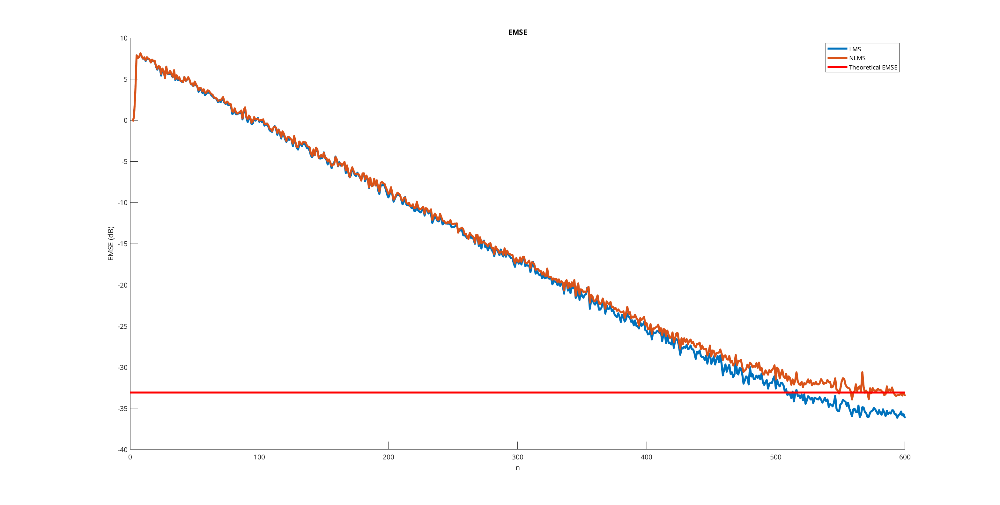

# Adaptive Filtering Examples
This repo contains FIR adaptive filters simulation examples to help to understand some core concepts.

For now it run several simulations for LMS and NLMS filters, and display performance metrics. 

Although the reference [1] is intended to provide the groundwork for adaptive networks, the concepts can be generalized to standalone filters. The pages 4 to 10 provide the necessary background to understand what is being done here.

## Getting Started
You must have MATLAB (Octave hasn't been tested yet), and run the `main.m` file.

## References
[1] A. H. Sayed. Diffusion Adaptation over Networks. 2012. [Link here.](https://arxiv.org/pdf/1205.4220.pdf)

## Expected Output

